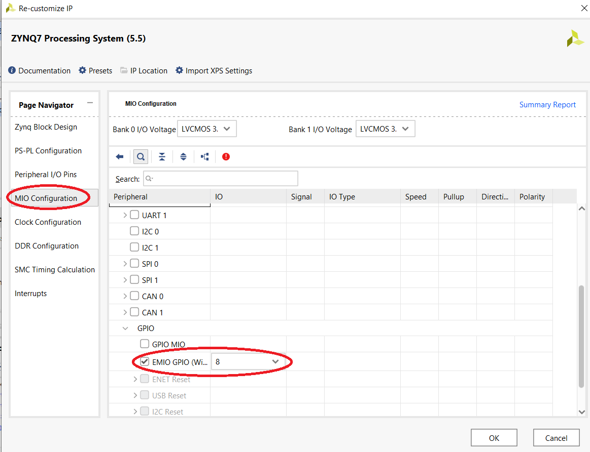

# PYNQ-Z1 board setup
---
Complete guide to setup the PYNQ board

# Prerequisite

- PYNQ-Z1 board
- 8GB micro SD card
- Xilinx Vivado 2019 or higher version (Vivado 2021.2 preferred)

## 1. PYNQ setup
The algorithm will be ported on a [Xilinx Pynq](http://www.pynq.io/) board. 
Here are the steps to setup the pynq board (can also be accessed [here](https://pynq.readthedocs.io/en/v2.0/getting_started.html))

- Download the Ubuntu image from the location: [Image](https://files.digilent.com/Products/PYNQ/pynq_z1_v2.0.img.zip)
- Unzip the Image and write the image in to the SD card using [BalenaEtcher](https://www.balena.io/etcher/) software
- Follow the instructions below to verify that the PYNQ board boots

- Set the JP4 / Boot jumper to the SD position by placing the jumper over the top two pins of JP4 as shown in the image. (This sets the board to boot from the Micro-SD card)
- To power the PYNQ-Z1 from the micro USB cable, set the JP5 / Power jumper to the USB position by placing the jumper over the top two pins.(You can also power the board from an external 12V power regulator by setting the jumper to REG)
- Insert the Micro SD card loaded with the PYNQ-Z1 image into the Micro SD card slot underneath the board
- Connect the USB cable to your PC/Laptop, and to the PROG - UART / J14 MicroUSB port on the board

At this instance, the board is set to be programmed. The next steps include the setup to connect the board to the PC via ethernet/LAN cable which can be perfromed in two ways. Setup links to program the PYNQ board are mentioned below-

- [Connect to the Network router](https://pynq.readthedocs.io/en/v2.0/getting_started.html#connect-to-a-network-router)
- [Connect to the Computer](https://pynq.readthedocs.io/en/v2.0/getting_started.html#connect-to-a-computer)

On sucessful access to Jupyter notebook on the PYNC board using one of the methods, it is recomended to use the http://IP_address/lab link to access all the files on the Jupyter notebook directory. 

## Testing the PYNQ board/ Getting started

All the steps to setup the board are complete at this stage and it is ready to be tested using a sample test design.

PYNQ_demo/Test_demo/PYNQ folder is prebuilt with a test project. The test project is initialized with the ZYNQ processor system which is connected to the basic gates using the GPIOs. The outputs of the gates are connected to the input pins of the GPIO. User can either use the prebuilt project from the repository or can build a project using the steps mentioned below. The following steps illustrates the detailed procedure to setup, starting from creating a project to running the python script for verification.

### Step1: Create a project

- Open the Xilinx Vivado software
- Click "Create a project" on the opening window as shown in the figure below

  

- Select an appropriate location and name for the project and press "Next" button till the "Default part" window appears as shown in the figure below 
 

- Select the part XC7Z020CLG400-1 from the list displayed at the bottom of the window as shown in the figure above. The list can be narrowed down by selecting "Zynq-7000" in the "Family" drop down  
- Then click "Next" which will navigate the user to the summary window of the project and the click "Finish". This sequence of operations will create the project sucessfully

### Step2: Creating design file

This step is to create a design to generate a programmable file to configure FPGA on the PYNQ board.

- To create the design file, click "Create Block design" as shown below

- After creating a board file, "Diagram" window appears which provides the options to add the IP blocks offered by Xilinx
- Add ZYNQ7-processing system by clicking on the "+" symbol in the "Diagram" window. After adding the zynq processor, a processor block will appear in the window as shown below

- Click on "Run Block Automation" on the top of the "Diagram" window highlited in green. This automatically adds the appropriate ports that needs to be connected to the processor 
- Double click on the Zynq processor block to chnage the configurations/settings. Enable the GPIOs by selecting the EMIO check box under the MIO_Configuration>> IO_peripherals>> GPIO section as illustrated in the figure below and set the GPIO width to 8

- Add the additional blocks and connect the blocks as shown in the figure below 

- After creating the design, the next step is to create the HDL wrapper by left clicking the design_1 block in the "Design" window and selecting "Create HDL wrapper". This creates a verilog file of the block design that was created in the diagram window
- Next step is to create the programmable file by clicking the "Generate Bitstream" in the PROGRAM AND DEBUG window on the bottom left corner of the software 
- On sucessful generation of bit file, program the FPGA by clicking the "program device" button in the same window

### Step3: Programing the Processor on PYNQ board
Final step is to program the ARM processor on PYNQ board

- This step requires the user to create a test folder in the PYNQ board
- Download the Test_demo/software/Test_code.ipynb from the repository
- Upload to the folder created on the PYNQ board
- The figure below shows the test code that is used to verify the design programmed in to the FPGA

- The code basically writes "1011" to the four input GPIO pins of the processor and reads the output of the basic gates
- The 4 outputs of the processor are currently connected to one 4-input AND gate and three 4-input XOR gates
- After executing the GPIO read function, the processor reads "1110" which is the output of the gates connected to the GPIO

On sucessfully reading the input gpio pins "1110", user can confirm complete setup of the PYNQ board. 

